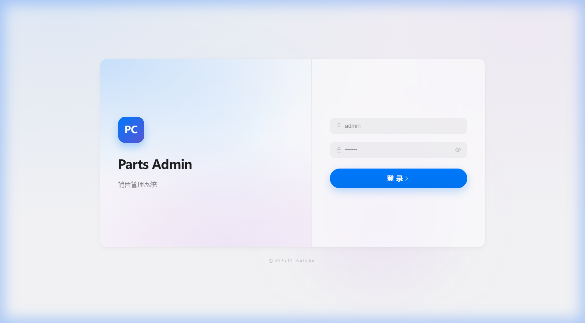
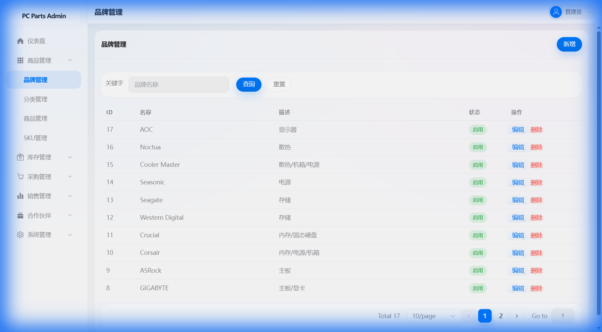
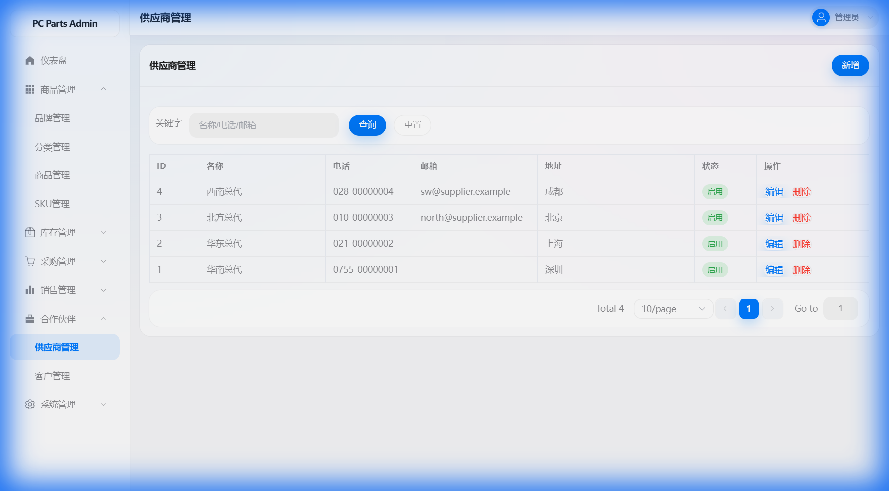
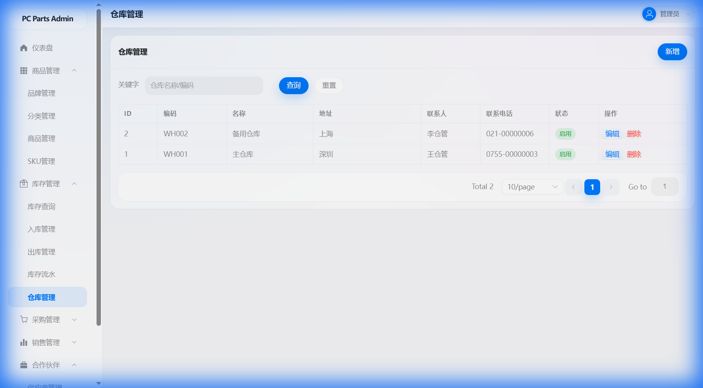

# PC-Market

PC-Market 是一个面向 PC 配件的进销存/管理后台示例项目，包含：

- **后端**：`pc-parts-management`（Spring Boot 3 / Spring Security / JWT / MyBatis-Plus / Flyway）
- **前端**：`pc-parts-admin`（Vue 3 / TypeScript / Vite / Element Plus / Pinia）

---

## 功能概览

- **认证**：登录、当前用户信息（JWT）
- **基础资料**：品牌、分类、商品（SPU）、SKU
- **库存**：仓库、库存查询、入库、出库、库存流水
- **往来**：供应商、客户
- **单据**：采购订单、销售订单（含收款/发货相关流程）
- **系统管理**：用户、角色、用户角色绑定

项目接口统一返回结构：`{ code, message, data }`；分页返回：`{ total, items }`。

---

## 环境要求

| 依赖     | 版本    | 备注 |
|----------|---------|------|
| JDK      | 17+     | 必须 |
| Maven    | 3.8+    | 必须 |
| Node.js  | 18+ LTS | 推荐 18 或 20 LTS |
| MySQL    | 8.0+    | 仅 MySQL 模式需要；H2 模式无需安装 |

---

## 标准化快速启动 — H2 内存数据库 (Zero Install)

无需安装 MySQL，一键启动用于快速验证。

### 1) 启动后端 (H2)
```bash
cd pc-parts-management
mvn spring-boot:run -Dspring-boot.run.profiles=dev-h2
```
- 后端: `http://localhost:18083`
- H2 Console: `http://localhost:18083/h2-console`

### 2) 启动前端
```bash
cd pc-parts-admin
npm install   # 仅首次
npm run dev -- --port 15175 --host
```
- 前端: `http://localhost:15175`

---

## 快速开始 — MySQL 模式 (生产)

### 1) 准备数据库

默认配置位于 `pc-parts-management/src/main/resources/application.yml`：

| 项目     | 默认值 |
|----------|--------|
| Host     | `localhost:3306` |
| Database | `pc_parts` |
| Username | `pc_parts` |
| Password | `pc_parts` |

```sql
CREATE DATABASE pc_parts DEFAULT CHARACTER SET utf8mb4 COLLATE utf8mb4_unicode_ci;
CREATE USER 'pc_parts'@'localhost' IDENTIFIED BY 'pc_parts';
GRANT ALL PRIVILEGES ON pc_parts.* TO 'pc_parts'@'localhost';
FLUSH PRIVILEGES;
```

后端使用 **Flyway** 自动建表与初始化数据（见 `src/main/resources/db/migration/`）。

### 2) 启动后端
```bash
cd pc-parts-management
mvn spring-boot:run
```
- 后端: `http://localhost:8080`
- Swagger UI: `http://localhost:8080/swagger-ui.html`

### 3) 启动前端

前端通过 Vite 代理 `/api` 到 `http://localhost:8080`（见 `pc-parts-admin/vite.config.ts`）。

```bash
cd pc-parts-admin
npm install   # 仅首次
npm run dev
```
- 前端: `http://localhost:5173`

---

## 端口一览

| 服务   | H2 (dev-h2) | MySQL (default) |
|--------|-------------|-----------------|
| 后端   | 18083       | 8080            |
| 前端   | 15175       | 5173            |

---

## 数据库模式

| Profile    | 数据库    | 配置文件 |
|------------|----------|---------|
| *(default)* | MySQL 8  | `application.yml` |
| `dev-h2`   | H2 (内存, MODE=MySQL) | `application-dev-h2.yml` |

H2 模式使用 `MODE=MySQL` 保证 SQL 兼容性。每次重启数据会重置。

---

## 默认账号

初始化数据中包含管理员账号（见 `V3__seed.sql`）：

| 用户名 | 密码   | 角色 |
|--------|--------|------|
| admin  | 123456 | 管理员 |

---

## 目录结构

```
PC-Market/
├── pc-parts-management/    # 后端服务 (Spring Boot + MyBatis-Plus + Flyway)
├── pc-parts-admin/         # 前端管理端 (Vue 3 + Element Plus + Pinia)
├── database/               # SQL 参考文件 (schema/seed)
├── screenshots/            # 项目截图
├── DEVELOPMENT_STATUS.md   # 功能完成度与待办
└── README.md
```

---

## 项目截图

| 页面 | 截图 |
|------|------|
| 登录界面 |  |
| 商品管理 |  |
| 品牌管理 |  |
| 供应商管理 |  |
| 仓库管理 |  |

---

## FAQ

**Q: H2 模式启动后数据是否持久化？**
A: 不会。H2 使用内存模式 (`mem:pcmarket`)，每次重启数据会重置。Flyway 会自动重新建表和加载种子数据。

**Q: JWT Secret 需要修改吗？**
A: 开发/演示环境可使用默认值。生产部署前**务必修改** `application.yml` 中的 `jwt.secret`（默认 `CHANGE_ME_TO_A_RANDOM_LONG_SECRET`）。

**Q: 前端代理如何配置？**
A: `pc-parts-admin/vite.config.ts` 中 `/api` 代理到后端地址。H2 模式下后端端口为 18083，需确认代理或使用 `--port 15175` 参数。

---

## 构建

### 后端
```bash
mvn -DskipTests package
```
产物：`pc-parts-management/target/*.jar`

### 前端
```bash
npm run build
npm run preview
```
产物：`pc-parts-admin/dist/`

---

## 配置说明

- **JWT Secret**：`application.yml` 中 `jwt.secret` 默认为 `CHANGE_ME_TO_A_RANDOM_LONG_SECRET`，部署前请务必修改。
- **账号密码策略**：示例数据里管理员密码使用 `{noop}123456`（仅用于演示），生产环境请使用安全密码与加密存储。

---

## 开发进度

见 `DEVELOPMENT_STATUS.md`。
